# GB_web_intro
GeekBrains. Знакомство с веб-технологиями (семинары)


**Задача**.


На основе сайта yandex.ru:
- Определите, на каком протоколе работает сайт.
- Проанализируйте структуру страницы сайта.
- Внесите не менее 10 изменений на страницу с помощью инструмента разработчика и представьте скриншоты было/стало.
- Создайте прототип низкой детализации (дополнительное задание, если на семинаре дошли до задания №8).


**Решение**.


- *Протокол*: https.


- *Структура сайта*:

    1. Боковое меню
    2. header со строкой поиска
    3. Оновной раздел с новостями и видео, прокручиваемый по вертикали


***Было***:
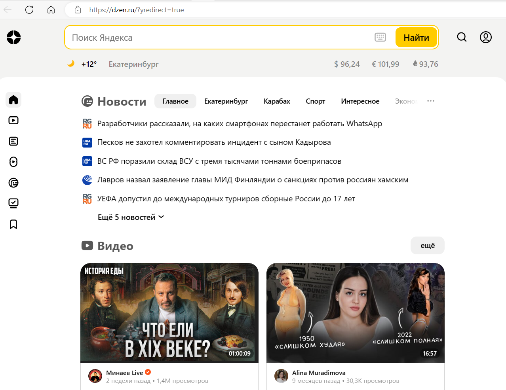


- *Изменение 1*

    Было:
    ```
    .desktop-layout-floors__container-2E {
        display: flex;
    }
    ```
    
    Стало:
    ```
    .desktop-layout-floors__container-2E {
        display: inline-grid;
        align-content: center;
        justify-content: start;
        align-items: baseline;
        justify-items: end;
    }
    ```

    Боковое меню выровнялось справа. Основной раздел сдвинулся вниз.
    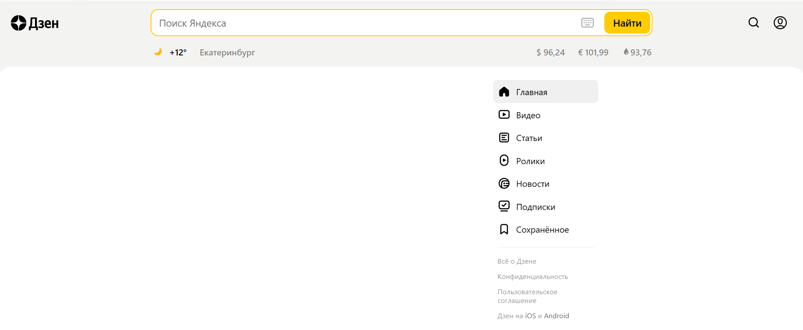


- *Изменение 2*

    Было:
    ```
    <div class="floor-title__title-2v floor-title__isRedesignTitleInFloors-2x floor-title__isNewsTitle-Oh">
        Новости
    </div>
    ```
    
    Стало:
    ```
    <div class="floor-title__title-2v floor-title__isRedesignTitleInFloors-2x floor-title__isNewsTitle-Oh">
        Гадости
    </div>
    ```

    Название первого элемента верхнего меню основного раздела изменилось с "Новости" на "Гадости".
    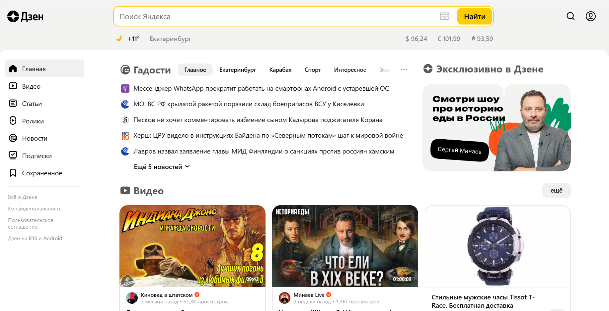


- *Изменение 3*

    Было:
    ```
    <div class="geoblock__wrapper-Yc" data-testid="weather-widget">
        <a class="geoblock__link-aX" aria-label="11 °C" data-testid="weather-link" href="https://dzen.ru/pogoda/54" rel="dofollow" target="_blank">
            <div class="geoblock__image-3g" style="background-image:url('//static.dzeninfra.ru/weather/i/icons/funky/dark/skc_n.svg')"></div>
            <div class="geoblock__currentWeather-2c">+11°</div>
        </a>
        <div class="geoblock__buttonContainer-2o">
            <button class="geoblock__location-3m" type="button">Екатеринбург</button>
        </div>
    </div>
    ```
    
    Стало:
    ```
    <div class="geoblock__wrapper-Yc" data-testid="weather-widget">
        <div class="geoblock__buttonContainer-2o">
            <button class="geoblock__location-3m" type="button">Екатеринбург</button>
        </div>
        <a class="geoblock__link-aX" aria-label="11 °C" data-testid="weather-link" href="https://dzen.ru/pogoda/54" rel="dofollow" target="_blank">
            <div class="geoblock__image-3g" style="background-image:url('//static.dzeninfra.ru/weather/i/icons/funky/dark/skc_n.svg')"></div>
            <div class="geoblock__currentWeather-2c">+11°</div>
        </a>
    </div>
    ```

    Поменялись местами температура и местоположение.
    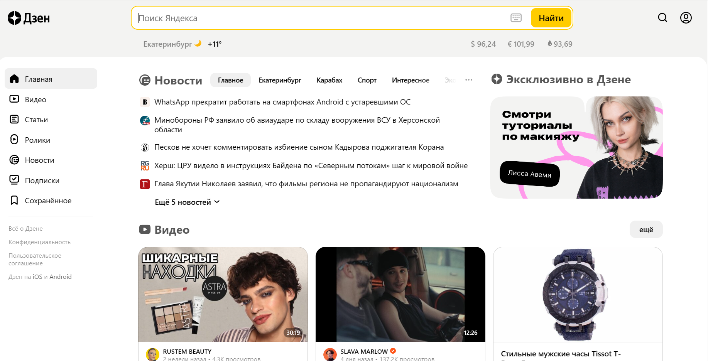


- *Изменение 4*

    Было:
    ```
    .arrow__button {
        cursor: pointer;
    }
    ```
    
    Стало:
    ```
    .arrow__button {
        cursor: move;
    }
    ```

    При наведении на кнопку "Найти" курсор принимает вид креста, как для перемещения объекта.


- *Изменение 5*

    Было:
    ```
    .currency-rates__rate-fu {
        letter-spacing: -.12px;
    }
    ```
    
    Стало:
    ```
    .currency-rates__rate-fu {
        letter-spacing: -12px;
    }
    ```

    Изменился пробел между элементами при отображении курсов валют.
    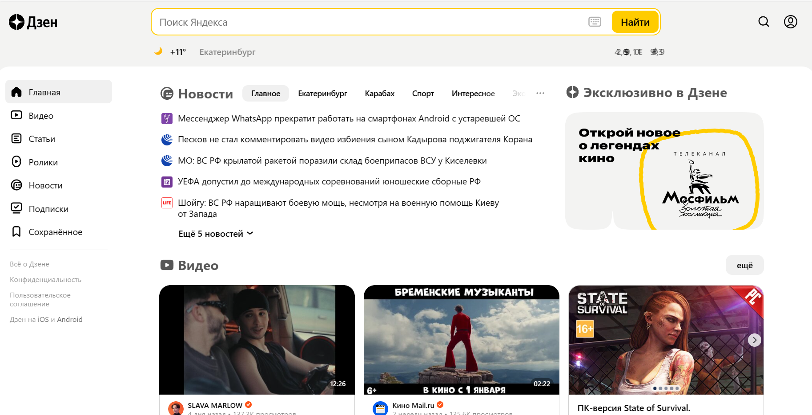


- *Изменение 6*

    Было:
    ```
    .kwq6wtEdmmUWCp9it__overflowBackground-3D {
        background-color: var(--zenColorBackgroundOverflow);
    }
    ```
    
    Стало:
    ```
    .kwq6wtEdmmUWCp9it__overflowBackground-3D {
        background-color: #f33;
    }
    ```

    Изменился цвет фона header с серого на красный.
    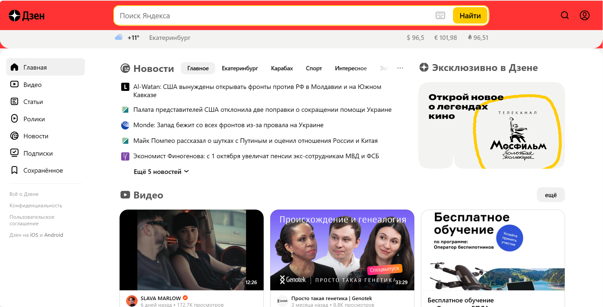


- *Изменение 7*

    Было:
    ```
    <a href="/" rel="dofollow" target="_self" class="desktop-base-header__logoLink-aE">
        <svg viewBox="0 0 24 24" class="desktop-base-header__logo-tA">
            <use xlink:href="#stella_logo_a8b2--react"></use>
        </svg>
    </a>
    ```
    
    Стало:
    ```
    <a href="/" rel="dofollow" target="_self" class="desktop-base-header__logoLink-aE">
        
    </a>
    ```

    Изменилась иконка.
    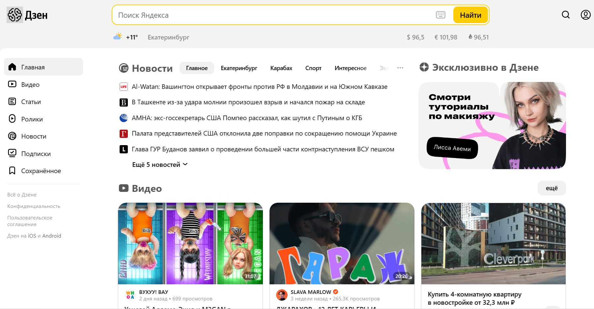


- *Изменение 8*

    Было:
    ```
    <div class="desktop-layout-floors__wrapper-2-">
        <main class="desktop-layout-floors__container-2E">
            <section class="desktop-layout-floors__leftColumn-2p">
            ...
            </section>
            <section class="desktop-layout-floors__content-DE desktop-layout-floors__isNewGridFloorsDesktop-3L">
            ...
            </section>
        </main>
    </div>
    ```
    
    Стало:
    ```
    <div class="desktop-layout-floors__wrapper-2-">
        <main class="desktop-layout-floors__container-2E">
            <section class="desktop-layout-floors__content-DE desktop-layout-floors__isNewGridFloorsDesktop-3L">
            ...
            </section>
            <section class="desktop-layout-floors__leftColumn-2p">
            ...
            </section>
        </main>
    </div>
    ```

    Изменился порядок: вместо "Боковое меню - Основной раздел" стало "Основной раздел - Боковое меню".
    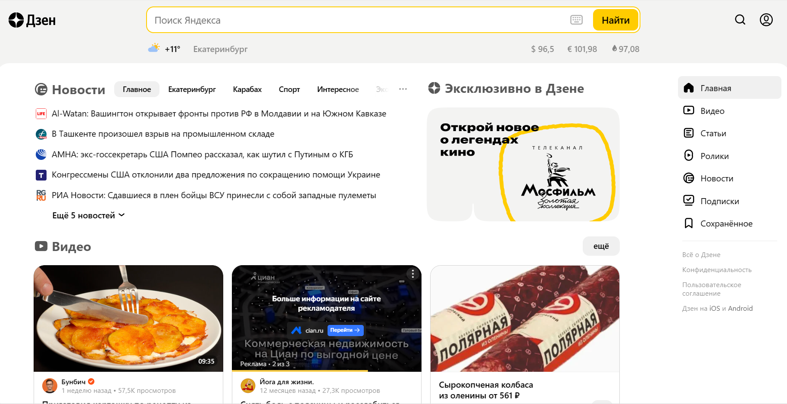


- *Изменение 9*

    Было:
    ```
    .geoblock__location-3m {
        font-size: 16px;
    }
    ```
    
    Стало:
    ```
    .geoblock__location-3m {
        font-size: 54px;
    }
    ```

    Изменился размер шрифта местоположения в header.
    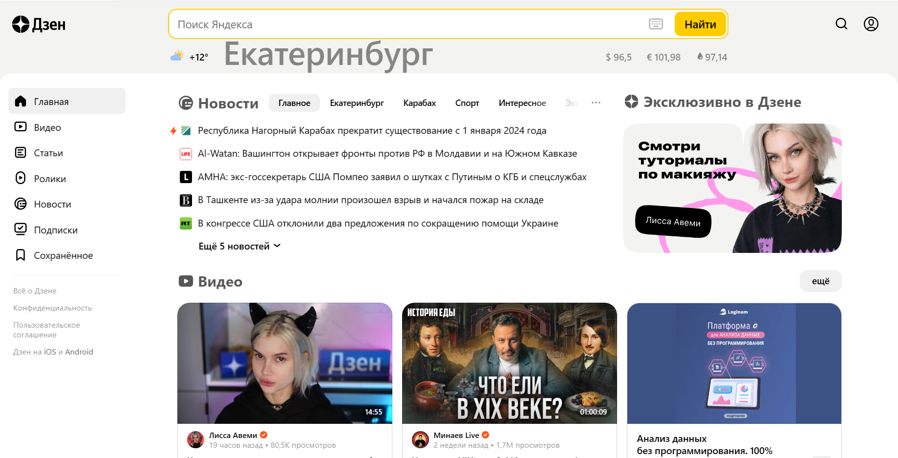


- *Изменение 10*

    Было:
    ```
    <div class="dzen-search-arrow-common__placeholder">Поиск Яндекса</div>
    ```
    
    Стало:
    ```
    <div class="dzen-search-arrow-common__placeholder">Поиск Дзена</div>
    ```

    Вместо "Поиск Яндекса" стало "Поиск Дзена".
    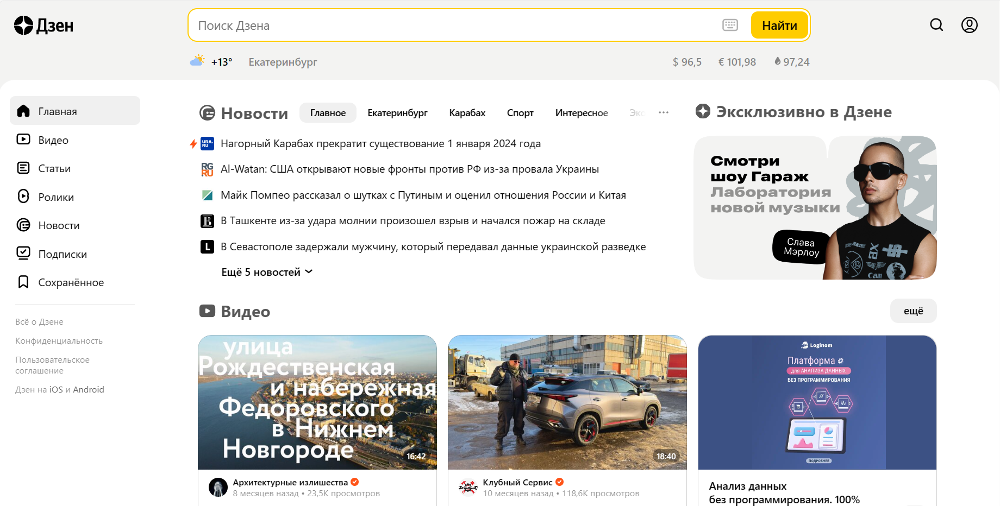


- *Прототип низкой детализации*
 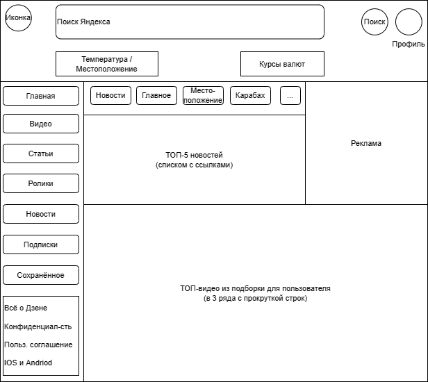